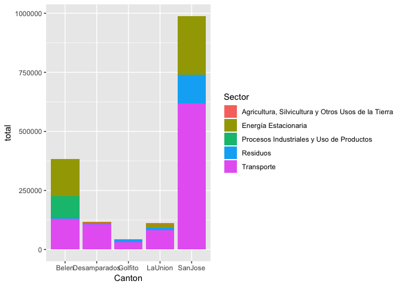
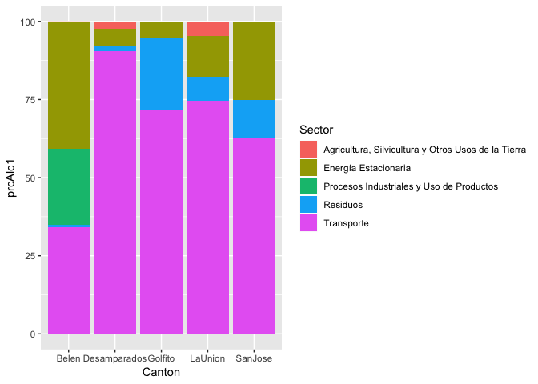
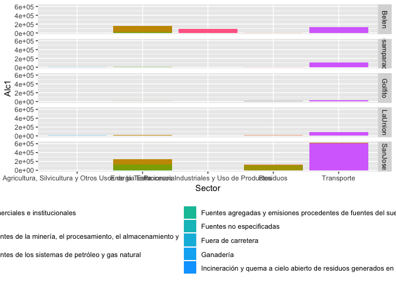

Analisis de los datos cantonales del piloto del Programa País Carbono
Neutral
================
Guillermo Durán Sanabria
12/6/2018

En este tutorial se trabajará con las tablas resultado del piloto del
**Programa País Carbono Neutralidad categoría cantonal**, suministrados
por la Dirección de Cambio Climático (DCC) del Ministerio de Ambiente y
Energía (MINAE).

La tabla contiene datos del inventario de emisiones de gases de efecto
invernadero realizado en los cantones de **Belén**, **San José**,
**Golfito**, **La Unión**, **Desamparados** y **Monteverde**. Más
información sobre el proyecto que generó estos datos puede accederse en
el sitio web de la DCC.

Los paquetes que se utilizarán en el análisis son:

``` r
library(tidyverse)
```

## Lectura de la tabla de datos

La tabla con los datos de los cantones pueden accederse en este enlace.

``` r
tablaGeneral <- read_csv("TablaGeneralCantones.csv")
```

    ## Parsed with column specification:
    ## cols(
    ##   aNo = col_double(),
    ##   Canton = col_character(),
    ##   Sector = col_character(),
    ##   Específico = col_character(),
    ##   `Alcance 1 (ton CO2 eq)` = col_character(),
    ##   `Alcance 2 (ton CO2 eq)` = col_character(),
    ##   `Alcance 3 (ton CO2 eq)` = col_character()
    ## )

La tabla tabla cuenta con siete columnas: - *aNo*: es el año en que se
tomaron las mediciones - *Canton*: cantón que reporta - *Sector*: sector
energético

### Resumen de variables:

Total de Sectores generales:

``` r
tablaGeneral %>% group_by(Sector) %>% summarise()
```

    ## # A tibble: 5 x 1
    ##   Sector                                             
    ##   <chr>                                              
    ## 1 Agricultura, Silvicultura y Otros Usos de la Tierra
    ## 2 Energía Estacionaria                               
    ## 3 Procesos Industriales y Uso de Productos           
    ## 4 Residuos                                           
    ## 5 Transporte

Total de sectores específicos:

``` r
tablaGeneral %>% group_by(`Específico`) %>% summarise()
```

    ## # A tibble: 22 x 1
    ##    Específico                                                              
    ##    <chr>                                                                   
    ##  1 Actividades agrícolas, de silvicultura y de pesca                       
    ##  2 Aguas residuales generadas en la ciudad                                 
    ##  3 Aviación                                                                
    ##  4 Construcción e industrias manufactureras                                
    ##  5 Disposición de residuos sólidos generados en la ciudad                  
    ##  6 Edificios e instalaciones comerciales e institucionales                 
    ##  7 Edificios residenciales                                                 
    ##  8 "Emisiones fugitivas provenientes de la minería, el procesamiento, el a…
    ##  9 Emisiones fugitivas provenientes de los sistemas de petróleo y gas natu…
    ## 10 Ferroviario                                                             
    ## # ... with 12 more rows

Número de sectores específicos por sectores
generales:

``` r
tablaGeneral %>% group_by(Sector, `Específico`) %>% summarise() %>% group_by(Sector) %>% summarise(n())
```

    ## # A tibble: 5 x 2
    ##   Sector                                              `n()`
    ##   <chr>                                               <int>
    ## 1 Agricultura, Silvicultura y Otros Usos de la Tierra     3
    ## 2 Energía Estacionaria                                    8
    ## 3 Procesos Industriales y Uso de Productos                2
    ## 4 Residuos                                                4
    ## 5 Transporte                                              5

Corrección de nombres de columnas y tipos de datos en las columnas:

``` r
tablaGeneral <- tablaGeneral %>% 
  mutate(
    Esp = `Específico`,
    Alc1 = as.numeric(`Alcance 1 (ton CO2 eq)`),
    Alc2 = as.numeric(`Alcance 2 (ton CO2 eq)`),
    Alc3 = as.numeric(`Alcance 3 (ton CO2 eq)`))
```

    ## Warning in evalq(as.numeric(`Alcance 1 (ton CO2 eq)`), <environment>): NAs
    ## introduced by coercion

    ## Warning in evalq(as.numeric(`Alcance 2 (ton CO2 eq)`), <environment>): NAs
    ## introduced by coercion

    ## Warning in evalq(as.numeric(`Alcance 3 (ton CO2 eq)`), <environment>): NAs
    ## introduced by coercion

## Gráficos

Total de emisiones de Alcance 1 por cantón:

``` r
ggplot(tablaGeneral %>% 
         group_by(Canton, Sector) %>% 
         summarise(total = sum(Alc1, na.rm = T)),
       aes(x = Canton, y =total, fill = Sector)) +
  geom_col()
```

<!-- -->

Muestra de sector como porcentaje del total de emisiones de cada cantón:

``` r
totalCanton <- tablaGeneral %>% 
  group_by(Canton) %>% 
  summarise(sumaAlc1 = sum(Alc1, na.rm = T),
            sumaAlc2 = sum(Alc2, na.rm = T))

ggplot(tablaGeneral %>% 
         group_by(Canton, Sector) %>% 
         summarise(SecAlc1 = sum(Alc1, na.rm = T)) %>% 
         left_join(totalCanton, by = "Canton") %>% 
         mutate(prcAlc1 = SecAlc1/sumaAlc1*100),
       aes(x = Canton, y =prcAlc1, fill = Sector)) +
  geom_col()
```

<!-- -->

Contribución por cada sector específico por cantón:

``` r
ggplot(tablaGeneral %>% 
         mutate(Alc1 = replace_na(Alc1, 0)),
       aes(x = Sector, y = Alc1, fill = Esp)) +
  geom_col() +
  facet_grid(rows = vars(Canton)) +
  theme(legend.position="bottom")
```

<!-- -->

``` r
tablaGeneral %>%
  mutate(Alc1 = replace_na(Alc1, 0)) %>% 
  group_by(Sector) %>% 
  summarise(suma = sum(Alc1))
```

    ## # A tibble: 5 x 2
    ##   Sector                                                 suma
    ##   <chr>                                                 <dbl>
    ## 1 Agricultura, Silvicultura y Otros Usos de la Tierra   8157.
    ## 2 Energía Estacionaria                                427679.
    ## 3 Procesos Industriales y Uso de Productos             93584.
    ## 4 Residuos                                            145217.
    ## 5 Transporte                                          968018.
